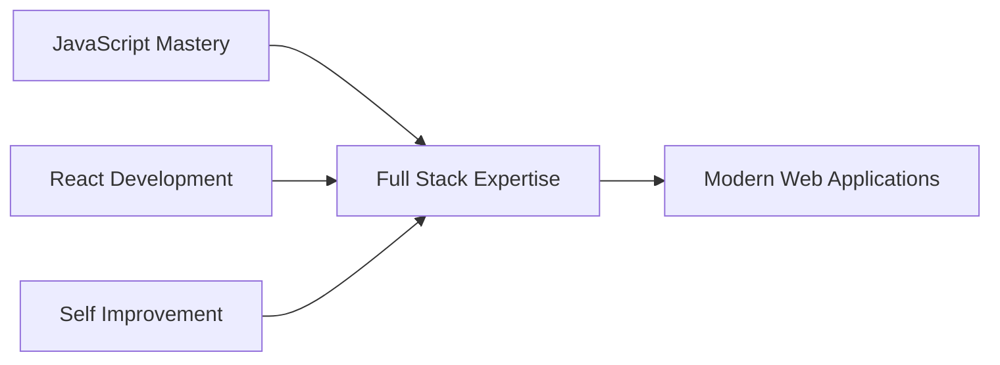

<div align="center">
  
# 👋 Hi, I'm Rakesh

### Full Stack Developer | JavaScript Enthusiast | React Specialist


</div>

---

## 🚀 About Me

```javascript
class Rakesh {
    constructor() {
        this.age = 22;
        this.role = "Full Stack Developer";
        this.currentlyLearning = ["JavaScript", "React"];
        this.focusArea = "Self Improvement & Continuous Learning";
        this.philosophy = "Keep building, keep learning, keep growing";
    }
    
    sayHi() {
        console.log("Thanks for visiting! Let's create something amazing together.");
    }
}

const me = new Rakesh();
me.sayHi();
```

- 🔭 **Current Focus:** Self-improvement and mastering modern web technologies
- 🌱 **Learning Journey:** Deep diving into JavaScript and React ecosystem
- 💡 **Philosophy:** Continuous growth through consistent practice
- 💬 **Ask me about:** JavaScript, React, MongoDB, Docker, Full Stack Development
- ⚡ **Fun fact:** Turning ideas into reality, one component at a time

---

## 🛠️ Tech Stack

<div align="center">

### Frontend


### Backend & Database


### DevOps & Tools


</div>

---

## 📊 GitHub Statistics

<div align="center">
  
  
</div>

<div align="center">
  
</div>

<div align="center">
  
</div>

---

## 🎯 Current Focus



- 🧠 Deepening JavaScript fundamentals
- ⚛️ Building dynamic React applications
- 🏗️ Exploring full stack architecture
- 📚 Continuous learning and skill enhancement

---

## 🌐 Connect With Me

<div align="center">

[](https://rakeshsenpai.github.io/My-Official-Portfolio/)
[](https://www.linkedin.com/in/rakesh-shil-339132335/)
[](https://x.com/home)
[](https://www.instagram.com/rakesh.senpai/)
[](https://github.com/RakeshSenpai)

</div>

---

## 💭 Random Dev Quote

<div align="center">


</div>

---

## 📈 Activity Graph

<div align="center">
  
</div>

---

<div align="center">

### 📊 Profile Views


### ⭐ Show some love by starring repositories you find interesting!


---

*"Code is like humor. When you have to explain it, it's bad."* - Cory House

**Made with ❤️ and JavaScript**

</div>
