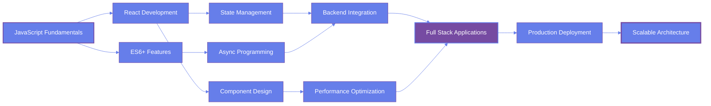

<div align="center">


</div>

<br/>

<p align="center">
  <a href="https://git.io/typing-svg"></a>
</p>

<div align="center">

[](https://rakeshsenpai.github.io/My-Official-Portfolio/)
[](https://www.linkedin.com/in/rakesh-shil-339132335/)
[](https://x.com/home)
[](https://www.instagram.com/rakesh.senpai/)

</div>

---

<br/>

## OVERVIEW


```javascript
class DeveloperProfile {
  constructor() {
    this.name = "Rakesh Shil";
    this.age = 22;
    this.location = "India";
    this.role = "Full Stack Developer";
    
    this.expertise = {
      frontend: ["JavaScript", "React", "HTML5", "CSS3"],
      backend: ["Node.js", "Express.js"],
      database: ["MongoDB"],
      tools: ["Docker", "Git", "VS Code"]
    };
    
    this.principles = [
      "Write clean, maintainable code",
      "Build scalable architectures",
      "Embrace continuous learning",
      "Focus on user experience"
    ];
  }
  
  getCurrentFocus() {
    return "Mastering modern JavaScript and React ecosystem";
  }
  
  getAvailability() {
    return "Open for collaboration and new opportunities";
  }
}

const developer = new DeveloperProfile();
console.log(developer.getCurrentFocus());
```

<br clear="right"/>

---

<br/>

## TECHNICAL EXPERTISE

<div align="center">

### Frontend Technologies

<table>
<tr>
<td align="center" width="96">

<br>JavaScript
</td>
<td align="center" width="96">

<br>React
</td>
<td align="center" width="96">

<br>HTML5
</td>
<td align="center" width="96">

<br>CSS3
</td>
<td align="center" width="96">

<br>Tailwind
</td>
<td align="center" width="96">

<br>Bootstrap
</td>
<td align="center" width="96">

<br>Sass
</td>
</tr>
</table>

### Backend & Database

<table>
<tr>
<td align="center" width="96">

<br>Node.js
</td>
<td align="center" width="96">

<br>Express
</td>
<td align="center" width="96">

<br>MongoDB
</td>
<td align="center" width="96">

<br>Postman
</td>
<td align="center" width="96">

<br>NPM
</td>
</tr>
</table>

### Development Tools

<table>
<tr>
<td align="center" width="96">

<br>Docker
</td>
<td align="center" width="96">

<br>Git
</td>
<td align="center" width="96">

<br>GitHub
</td>
<td align="center" width="96">

<br>VS Code
</td>
<td align="center" width="96">

<br>Linux
</td>
<td align="center" width="96">

<br>Bash
</td>
</tr>
</table>

### Currently Exploring

<table>
<tr>
<td align="center" width="96">

<br>TypeScript
</td>
<td align="center" width="96">

<br>Next.js
</td>
<td align="center" width="96">

<br>Redux
</td>
<td align="center" width="96">

<br>Webpack
</td>
<td align="center" width="96">

<br>GraphQL
</td>
</tr>
</table>

</div>

---

<br/>

## GITHUB ANALYTICS

<div align="center">


</div>

<br/>

<div align="center">


</div>

<br/>

<div align="center">


</div>

---

<br/>

## DEVELOPMENT PHILOSOPHY

<table>
<tr>
<td width="33%" valign="top">

### Code Quality
```yaml
Principles:
  - Clean Architecture
  - SOLID Principles
  - DRY & KISS
  - Code Reviews
  - Documentation
  - Testing
```

</td>
<td width="33%" valign="top">

### Current Focus
```yaml
Learning:
  - Advanced JavaScript
  - React Patterns
  - System Design
  - Performance Optimization
  - Best Practices
```

</td>
<td width="33%" valign="top">

### Goals 2024
```yaml
Objectives:
  - Build Production Apps
  - Open Source Contribution
  - Master Full Stack
  - Technical Writing
  - Community Engagement
```

</td>
</tr>
</table>

---

<br/>

## DEVELOPMENT ROADMAP

<div align="center">



</div>

---

<br/>

## PROFESSIONAL ENGAGEMENT

<div align="center">

| Area | Description | Status |
|------|-------------|--------|
| **Freelancing** | Available for web development projects | Open |
| **Collaboration** | Open source and team projects | Active |
| **Mentoring** | Guiding junior developers | Available |
| **Learning** | Continuous skill development | Ongoing |
| **Networking** | Building professional connections | Active |

</div>

---

<br/>

## CONTACT & COLLABORATION

<div align="center">

### Professional Network

<a href="https://rakeshsenpai.github.io/My-Official-Portfolio/">
  
</a>
<a href="https://www.linkedin.com/in/rakesh-shil-339132335/">
  
</a>
<a href="https://github.com/RakeshSenpai">
  
</a>

### Social Presence

<a href="https://x.com/home">
  
</a>
<a href="https://www.instagram.com/rakesh.senpai/">
  
</a>

</div>

<br/>

<table align="center">
<tr>
<td align="center" width="50%">

**Open For**
- Freelance Projects
- Full-time Opportunities
- Collaborative Development
- Technical Consulting

</td>
<td align="center" width="50%">

**Interested In**
- Modern Web Technologies
- Scalable Architecture
- Performance Optimization
- User Experience Design

</td>
</tr>
</table>

---

<br/>

## CONTRIBUTION ACTIVITY

<div align="center">

<picture>
  <source media="(prefers-color-scheme: dark)" srcset="https://raw.githubusercontent.com/RakeshSenpai/RakeshSenpai/output/github-contribution-grid-snake-dark.svg">
  <source media="(prefers-color-scheme: light)" srcset="https://raw.githubusercontent.com/RakeshSenpai/RakeshSenpai/output/github-contribution-grid-snake.svg">
  
</picture>

</div>

---

<br/>

<div align="center">

## PROFILE METRICS


</div>

---

<br/>

<div align="center">

### Development Wisdom


</div>

<br/>

<div align="center">


**Crafted with precision and passion**

*"Code is like humor. When you have to explain it, it's bad." - Cory House*

**Rakesh Shil | Full Stack Developer | 2024**

</div>
