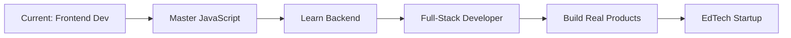

<div align="center">

# 👨‍💻 Hi there, I'm [Your Name]

### Computer Science Student | Frontend Developer | Tech Enthusiast


[](https://github.com/yourusername)
[](https://linkedin.com/in/yourprofile)
[](mailto:your.email@example.com)

</div>

---

## 🚀 About Me

```javascript
const developer = {
    location: "India 🇮🇳",
    currentRole: "Computer Science Student & Frontend Developer",
    level: "Beginner → Intermediate",
    learning: ["Backend Development", "DBMS", "Full-Stack Architecture"],
    interests: ["Web Development", "EdTech", "Startups", "Financial Literacy"],
    goal: "Build real-world tech products that make a difference",
    motto: "One project at a time, one concept at a time"
};
```

I'm passionate about creating **clean, functional web applications** and exploring how technology can solve real-world problems, especially in **education and business**. Currently on a journey to become a **full-stack developer** who builds products that matter.

---

## 🛠️ Skills & Technologies

<div align="center">

### Frontend Development


### Tools & Platforms


</div>

**Core JavaScript Skills:**
- ✅ DOM Manipulation & Event Handling
- ✅ Promises & Async/Await
- ✅ ES6+ Features (Destructuring, Spread/Rest, Arrow Functions)
- ✅ Date & Time Handling
- ✅ Modern JavaScript Fundamentals

---

## 🌱 Currently Learning / Exploring

<table>
<tr>
<td width="50%">

### 📚 Technical Skills
- 🔄 **Deep JavaScript revision** for solid foundations
- 🗄️ **DBMS fundamentals** & database design
- 🌐 **Backend development** (MERN vs PERN)
- 🔧 Data structures & algorithms

</td>
<td width="50%">

### 🎯 Interest Areas
- 🤖 **AI in EdTech** applications
- 💼 **Startup ecosystems** & business models
- 💰 **Financial literacy** & tech business
- 🚀 Building **scalable products**

</td>
</tr>
</table>

---

## 💼 Projects

<div align="center">

| Project | Description | Tech Stack |
|---------|-------------|------------|
| **🎓 ClassRank** | Attendance tracking & student ranking system | JavaScript, HTML, CSS |
| **⚡ JS Mini Projects** | Practice projects for core concepts | Vanilla JavaScript |
| **📖 EdTech Experiments** | Educational technology explorations | Web Technologies |
| **🏫 College Projects** | Academic applications & assignments | Various |

</div>

> 💡 **Note:** All projects are works in progress. I'm constantly learning and improving them as I gain new knowledge.

---

## 🎯 Goals & Roadmap



### 📍 Short-term Goals
- ✨ Master JavaScript fundamentals completely
- 🔨 Build a complete full-stack application
- 🤝 Contribute to open-source projects
- 📈 Strengthen DSA knowledge

### 🚀 Long-term Vision
- 💪 Become a strong full-stack developer
- 🏗️ Build real-world tech products that solve meaningful problems
- 🎓 Create impactful EdTech solutions
- 💼 Understand startup ecosystems and build scalable businesses

---

## 📊 GitHub Stats

<div align="center">


</div>

<div align="center">

[](https://git.io/streak-stats)

</div>

---

## 📫 Let's Connect!

<div align="center">

I'm always open to connecting with fellow developers, learning from others, and collaborating on interesting projects.

[](https://linkedin.com/in/yourprofile)
[](mailto:your.email@example.com)
[](https://twitter.com/yourhandle)
[](https://yourportfolio.com)

</div>

---

<div align="center">

### 💭 Quote I Live By

*"Building one project at a time, learning something new every day."*


⭐️ From [yourusername](https://github.com/yourusername)

</div>
