```mermaid
%%{init: {'theme':'dark', 'themeVariables': { 'primaryColor':'#00D9FF','primaryTextColor':'#fff','primaryBorderColor':'#FFD700','lineColor':'#00D9FF','secondaryColor':'#1a1a2e','tertiaryColor':'#0D1117'}}}%%

graph TB
    Start([🎯 Current State]) --> A[💻 JavaScript Deep Dive]
    Start --> B[⚛️ React Mastery]
    Start --> C[🗄️ Backend Development]
    
    A --> D[🔧 Advanced Concepts]
    B --> E[🎨 Component Architecture]
    C --> F[📊 Database Optimization]
    
    D --> G[🚀 Full Stack Expertise]
    E --> G
    F --> G
    
    G --> H[🌟 Production-Ready Apps]
    G --> I[🏗️ Scalable Solutions]
    G --> J[✨ Beautiful UX]
    
    H --> K([💎 Senior Developer])
    I --> K
    J --> K
    
    K --> L([🌍 Tech Industry Impact])
    
    style Start fill:#00D9FF,stroke:#FFD700,stroke-width:3px,color:#000
    style K fill:#FFD700,stroke:#00D9FF,stroke-width:3px,color:#000
    style L fill:#00FF87,stroke:#00D9FF,stroke-width:3px,color:#000
    style G fill:#FF6B6B,stroke:#FFD700,stroke-width:2px,color:#000
```

<div align="center">

<!-- Stunning Premium Header -->


<!-- Glowing Typing Effect -->
<p align="center">
  
</p>

<!-- Elegant Badges -->
<p align="center">
  
  
  
</p>

<!-- Animated Divider -->


</div>

<br/>

<!-- Premium About Section -->
<div align="center">
  
##  The Art of Code

</div>


```typescript
interface Developer {
    name: string;
    role: string;
    location: string;
    age: number;
    passions: string[];
    currentMission: string;
    techStack: TechStack;
}

interface TechStack {
    frontend: string[];
    backend: string[];
    database: string[];
    tools: string[];
}

const rakesh: Developer = {
    name: "Rakesh Shil",
    role: "Full Stack Developer 💻",
    location: "India 🇮🇳",
    age: 22,
    passions: [
        "Building Scalable Applications 🚀",
        "Creating Seamless UX ✨",
        "Continuous Learning 📚",
        "Open Source Contribution 🌍"
    ],
    currentMission: "Mastering the art of modern web development",
    techStack: {
        frontend: ["React ⚛️", "JavaScript 🟨", "HTML5 & CSS3 🎨"],
        backend: ["Node.js 🟢", "Express.js ⚡"],
        database: ["MongoDB 🍃"],
        tools: ["Docker 🐳", "Git & GitHub 🔧", "VS Code 💙"]
    }
};

// Life Philosophy
console.log("🎯 Keep building, keep learning, keep evolving");
// Mission Statement  
console.log("💡 Turning caffeine into code, ideas into reality");
```

<br clear="right"/>

<div align="center">
  
<!-- Premium Quote Card -->


</div>

<br/>

<!-- Animated Divider -->


<br/>

<!-- Premium Tech Stack Section -->
<div align="center">

##  Technology Arsenal

</div>

<br/>

<table align="center">
<tr>
<td width="50%" align="center">

### 🎨 Frontend Mastery

<p align="center">
  
</p>

**Languages & Frameworks**
```yaml
JavaScript: Advanced proficiency
React: Building scalable SPAs
HTML5/CSS3: Semantic & responsive design
Tailwind CSS: Rapid UI development
```

</td>
<td width="50%" align="center">

### ⚙️ Backend Engineering

<p align="center">
  
</p>

**Server & Database**
```yaml
Node.js: Server-side development
Express.js: RESTful API design
MongoDB: NoSQL database expert
API Design: RESTful architecture
```

</td>
</tr>

<tr>
<td width="50%" align="center">

### 🛠️ DevOps & Tools

<p align="center">
  
</p>

**Development Workflow**
```yaml
Docker: Containerization
Git/GitHub: Version control mastery
VS Code: Primary IDE
Linux: Command-line proficiency
```

</td>
<td width="50%" align="center">

### 🚀 Currently Exploring

<p align="center">
  
</p>

**Next-Gen Technologies**
```yaml
TypeScript: Type-safe development
Next.js: React framework
Redux: State management
GraphQL: Modern API queries
```

</td>
</tr>
</table>

<br/>

<!-- Animated Divider -->


<br/>

<!-- Premium GitHub Stats -->
<div align="center">

##  GitHub Analytics & Performance

</div>

<br/>

<p align="center">
  
  
</p>

<br/>

<p align="center">
  
  
</p>

<br/>

<!-- Trophy Showcase -->
<p align="center">
  
</p>

<br/>

<!-- Animated Divider -->


<br/>

<!-- Premium Roadmap Section -->
<div align="center">

##  Development Roadmap & Vision

</div>

<br/>



<br/>

<!-- Premium Goals Table -->
<table align="center">
<tr>
<td align="center" width="33%">

### 📚 Learning Focus
```diff
+ Advanced JavaScript Patterns
+ React Performance Optimization
+ System Design Principles
+ TypeScript Integration
+ Testing & Quality Assurance
```

</td>
<td align="center" width="33%">

### 🎯 2024 Goals
```diff
! Build 10+ Production Projects
! Contribute to Open Source
! Master Full Stack Development
! Launch Personal SaaS Product
! Grow Developer Community
```

</td>
<td align="center" width="33%">

### 🚀 Future Vision
```diff
# Senior Full Stack Developer
# Tech Lead / Architect
# Open Source Maintainer
# Technical Content Creator
# Startup Founder
```

</td>
</tr>
</table>

<br/>

<!-- Animated Divider -->


<br/>

<!-- Premium Connect Section -->
<div align="center">

##  Let's Connect & Collaborate

<p>
  <i>Building the future of web, one commit at a time. Let's create something extraordinary together!</i>
</p>

</div>

<br/>

<p align="center">
  <a href="https://rakeshsenpai.github.io/My-Official-Portfolio/" target="_blank">
    
  </a>
  <a href="https://www.linkedin.com/in/rakesh-shil-339132335/" target="_blank">
    
  </a>
  <a href="https://x.com/home" target="_blank">
    
  </a>
  <a href="https://www.instagram.com/rakesh.senpai/" target="_blank">
    
  </a>
</p>

<br/>

<!-- Contact Cards -->
<table align="center">
<tr>
<td align="center" width="50%">

### 💼 Professional Collaboration
```yaml
Open for: Freelance Projects
Available: Full-time Opportunities
Interested in: Innovative Startups
Consulting: Web Development
```
<a href="mailto:your.email@example.com">
  
</a>

</td>
<td align="center" width="50%">

### 🤝 Community & Networking
```yaml
Mentoring: Junior Developers
Speaking: Tech Talks & Workshops
Writing: Technical Blogs
Contributing: Open Source Projects
```
<a href="https://github.com/RakeshSenpai">
  
</a>

</td>
</tr>
</table>

<br/>

<!-- Animated Divider -->


<br/>

<!-- Snake Animation -->
<div align="center">

## 🐍 Contribution Snake - Eating My Commits!

<picture>
  <source media="(prefers-color-scheme: dark)" srcset="https://raw.githubusercontent.com/RakeshSenpai/RakeshSenpai/output/github-contribution-grid-snake-dark.svg">
  <source media="(prefers-color-scheme: light)" srcset="https://raw.githubusercontent.com/RakeshSenpai/RakeshSenpai/output/github-contribution-grid-snake.svg">
  
</picture>

</div>

<br/>

<!-- Animated Divider -->


<br/>

<!-- Premium Footer -->
<div align="center">

### 💎 Profile Insights

<p>
  
  
  
</p>

<br/>

### 🌟 Featured Achievements

<p>
  
  
  
  
  
</p>

<br/>

---

<br/>

### 💭 Developer Wisdom

<p align="center">
  
</p>

<br/>

---

<br/>

<table align="center">
<tr>
<td align="center" width="50%">

### ⭐ Support My Journey
<p><i>If you find my work valuable, consider:</i></p>

🌟 **Starring** my repositories  
👥 **Following** my GitHub profile  
💬 **Sharing** your feedback  
🤝 **Collaborating** on projects  

</td>
<td align="center" width="50%">

### 🎯 Let's Build Together
<p><i>I'm always excited to:</i></p>

💡 **Discuss** innovative ideas  
🚀 **Work** on challenging projects  
📚 **Learn** from the community  
🌍 **Contribute** to open source  

</td>
</tr>
</table>

<br/>

---

<br/>

<p align="center">
  
</p>

<p align="center">
  
</p>

<p align="center">
  <i>"Code is poetry written in logic, and every function is a verse in the symphony of innovation."</i>
</p>

<p align="center">
  <strong>© 2024 Rakesh Shil • Full Stack Developer • Digital Craftsman</strong>
</p>

</div>
